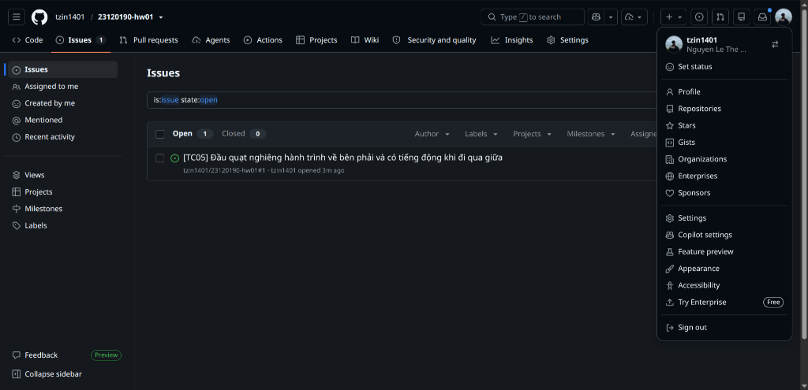

# Bản nháp GitHub Issue — TC05

**Trạng thái:** Người kiểm thử xác nhận TC05 Fail với hiện tượng bên dưới. Đây vẫn là bản nháp, chưa đăng lên GitHub; mức độ và các số đo chi tiết chưa được xác định.

## Tiêu đề dự kiến

`[TC05] Đầu quạt nghiêng hành trình về bên phải và có tiếng động khi đi qua giữa`

## Nội dung dự kiến để dán vào Issue

### Thiết bị và test case

- Thiết bị: quạt Senko L1638 (theo thông tin người sở hữu); thiết bị không có số serial.
- Test case: TC05 — chuyển hướng trái/phải.

### Điều kiện và bước tái hiện

1. Đặt quạt trên mặt phẳng, đủ khoảng trống để đầu quạt chuyển hướng; xác nhận chế độ chuyển hướng đã bật.
2. Chạy quạt ở mức tốc độ đã dùng khi quay video TC05: **[người kiểm thử điền]**.
3. Quan sát ít nhất một hành trình trái–phải đầy đủ; ghi vị trí giới hạn mỗi bên và thời điểm âm thanh xuất hiện.
4. Lặp lại **[số lần]** để kiểm tra hiện tượng có tái diễn.

### Expected

Đầu quạt chuyển hướng đều và ổn định giữa hai bên, không phát tiếng va/cọ/kẹt bất thường trong hành trình. Đây là tiêu chí của TC05; nếu kết luận góc trái–phải không đạt, cần nêu cơ sở so sánh hoặc số đo chứ không chỉ dựa vào cảm giác.

### Actual — người kiểm thử báo cáo

- Đầu quạt **có xu hướng quay nhiều về phía bên phải hơn**.
- Quạt **phát ra tiếng động khi đầu quạt đi qua vị trí giữa**.
- Chưa có số đo góc trái/phải, mô tả loại tiếng động, số lần lặp lại hoặc xác nhận âm thanh là va/cọ/kẹt bất thường.
- **Verdict của TC05: Fail**, theo xác nhận của người kiểm thử.

### Bằng chứng

- File video gốc: [`TC05.mp4`](../05_Execution_Videos/TC05.mp4).
- URL video YouTube: https://youtube.com/shorts/b-d0SKiaxsM (người đăng xác nhận đã đặt Không công khai).
- Ảnh/số đo góc trái–phải: **[chưa cung cấp]**.

### Mức độ nghiêm trọng

**Chưa kết luận**. Xác định sau khi đối chiếu âm thanh, mức cản trở chuyển hướng và khả năng tái diễn. Không gán nguyên nhân cơ khí cụ thể khi chưa kiểm tra.

## Cần hoàn tất trước khi tạo Issue

- Xác nhận tiếng động là tiếng cọ, va, kẹt bất thường hay chỉ là tiếng vận hành bình thường.
- Ghi số lần tái hiện, tốc độ quạt, vị trí tiếng động và nếu có thể thì đo/đánh dấu hai biên chuyển hướng.
- Bổ sung số đo hoặc mô tả rõ hơn để người khác có thể tái hiện và đánh giá mức độ lỗi.
- Khi đăng Issue thật, thay link file cục bộ bằng link video xem được từ GitHub hoặc YouTube; giữ ảnh/video bằng chứng do người kiểm thử tự tạo.

## Bằng chứng ảnh GitHub Issue

